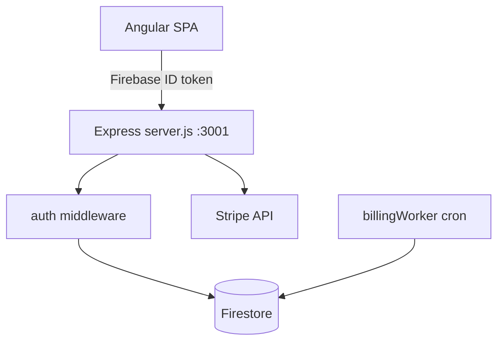

# Simple4U — Backend API

**Simple4U** backend is a **Node.js / Express 5** REST API for private tutors. It stores data in **Cloud Firestore** (via Firebase Admin SDK), authenticates requests with **Firebase ID tokens**, handles **Stripe** subscriptions, and runs background jobs for lesson billing and recurring schedules.

Companion frontend documentation: [../README.md](../README.md).

---

## Product overview

The API powers a tutor-focused CRM:

| Domain | Capabilities |
|--------|----------------|
| **Auth & profile** | Bootstrap tutor document on first login, onboarding, tax mode, workspace and working hours |
| **Students** | CRUD, hourly rates, currencies, prepaid lesson balance, top-ups, activity logs |
| **Lessons** | CRUD, collision detection, recurring series (RRULE), status workflow, balance billing on completion/cancel |
| **Finance** | Income from lessons, expenses CRUD, multi-currency summary, Austria tax estimates |
| **Billing** | Stripe Checkout for Pro, webhook for subscription status |
| **Admin** | Super-admin stats, user list, subscription management, trial grants |

All protected resources are **multi-tenant**: every query is scoped to the authenticated tutor (`req.user.id` = Firebase UID).

---

## Tech stack

| Category | Technologies |
|----------|--------------|
| Runtime | Node.js **20+** |
| HTTP | Express **5** |
| Database | Cloud Firestore (`firebase-admin`) |
| Auth | Firebase Admin — `verifyIdToken` on `Authorization: Bearer` |
| Payments | Stripe (Checkout + webhooks) |
| Email | Nodemailer (verification / transactional) |
| Scheduling | `node-cron` — billing worker every 10 minutes |
| Recurrence | `rrule` (shared semantics with frontend) |
| Tests | Node.js built-in test runner (`node --test`) |

---

## Architecture



### Data flow

1. User signs in on the frontend via **Firebase Auth**.
2. Frontend sends `Authorization: Bearer <ID token>` to `/api/*`.
3. `auth` middleware verifies the token and sets `req.user = { id, email, email_verified }`.
4. `POST /api/auth/bootstrap` ensures a `users/{uid}` document exists in Firestore.
5. CRUD routes read/write `students`, `lessons`, `expenses`, `balance_logs` filtered by tutor id.

---

## Firestore collections

| Collection | Purpose |
|------------|---------|
| `users` | Tutor profile, subscription, tax mode, workspace, onboarding flags |
| `students` | Per-tutor students, rates, lesson balance |
| `lessons` | Scheduled/completed lessons, recurrence, billing flags |
| `expenses` | Tutor business expenses |
| `balance_logs` | Audit trail for lesson balance changes |

Document id for tutors equals **Firebase UID**.

---

## Project structure

```
backend/
├── server.js                 # Express entry, route mounting, health checks
├── apphosting.yaml           # Firebase App Hosting (tutor-app-backend)
├── .env.example              # environment template
├── package.json
├── scripts/
│   ├── confirm-subscription.js
│   └── set-super-admin.js
└── src/
    ├── firebase.js           # Admin SDK init
    ├── routes/
    │   ├── auth.js           # bootstrap, me, onboarding
    │   ├── students.js       # CRUD, topup, activity logs
    │   ├── lessons.js        # CRUD, cancel-with-billing
    │   ├── finance.js        # summary, expenses
    │   ├── billing.js        # Stripe checkout
    │   ├── billingWebhook.js # Stripe webhooks (raw body)
    │   └── admin.js          # super-admin endpoints
    ├── middleware/
    │   ├── auth.js           # Firebase ID token
    │   ├── requireVerifiedEmail.js
    │   ├── requireSuperAdmin.js
    │   ├── lessonCollision.js
    │   └── error.js
    ├── services/
    │   ├── lessonBilling.js
    │   ├── lessonOccurrence.js
    │   ├── emailVerificationService.js
    │   └── emailService.js
    └── utils/
        ├── billingWorker.js      # cron: bill completed lessons
        ├── lessonRecurrence.js
        ├── financeTax.js
        ├── currencyConvert.js
        └── …
```

---

## API endpoints

Base URL: `http://localhost:3001` (local) or App Hosting URL in production.

### Health

| Method | Path | Description |
|--------|------|-------------|
| GET | `/` | Service status |
| GET | `/api/health` | API + Firestore indicator |
| GET | `/api/health/firestore` | Firestore connectivity check |

### Auth (`/api/auth`) — requires Bearer token

| Method | Path | Description |
|--------|------|-------------|
| POST | `/bootstrap` | Create or sync tutor profile |
| GET | `/me` | Current user profile |
| PUT | `/me` | Update profile |
| PATCH | `/me/marketing-cookies` | Cookie consent |
| POST | `/onboarding` | Complete onboarding |
| POST | `/onboarding/decline` | Decline and sign out flow |

### Students (`/api/students`) — auth + verified email

| Method | Path | Description |
|--------|------|-------------|
| GET | `/` | List students |
| GET | `/:id` | Single student |
| POST | `/` | Create student |
| PUT | `/:id` | Update student |
| DELETE | `/:id` | Delete student |
| POST | `/:id/topup` | Add lesson package balance |
| GET | `/activity-logs` | Balance activity history |

### Lessons (`/api/lessons`) — auth + verified email

| Method | Path | Description |
|--------|------|-------------|
| GET | `/` | List lessons (optional date range) |
| POST | `/` | Create lesson (collision check) |
| PUT | `/:id` | Update lesson |
| DELETE | `/:id` | Delete lesson |
| POST | `/:id/cancel-with-billing` | Cancel with balance rules |

### Finance (`/api/finance`) — auth + verified email

| Method | Path | Description |
|--------|------|-------------|
| GET | `/summary` | Period income, expenses, tax hints |
| GET | `/expenses` | List expenses |
| POST | `/expenses` | Create expense |
| PUT | `/expenses/:id` | Update expense |
| DELETE | `/expenses/:id` | Delete expense |
| GET | `/activity-logs` | Finance-related activity |

### Billing (`/api/billing`) — auth + verified email

| Method | Path | Description |
|--------|------|-------------|
| POST | `/checkout-session` | Create Stripe Checkout session |
| POST | `/confirm-payment` | Confirm payment after redirect |

### Billing webhook

| Method | Path | Description |
|--------|------|-------------|
| POST | `/api/billing/webhook` | Stripe events (raw body, no JSON parser) |

### Admin (`/api/admin`) — super-admin only

| Method | Path | Description |
|--------|------|-------------|
| GET | `/stats` | Platform statistics |
| GET | `/users` | User list |
| PUT | `/users/:id/subscription` | Set subscription status |
| POST | `/users/:id/grant-trial` | Grant trial period |

---

## Authentication

- **No custom JWT login** — clients use Firebase Auth; the API only verifies ID tokens.
- Header: `Authorization: Bearer <Firebase ID token>`.
- Disposable email domains are rejected at the middleware layer.
- Most business routes also require `email_verified === true` (`requireVerifiedEmail`).

Default profile on first bootstrap:

- `country_settings`: AT  
- `timezone`: `Europe/Vienna`  
- `tax_mode`: `none` (configured during onboarding)  
- `subscription_status`: `free`  

---

## Background workers

| Worker | Schedule | Role |
|--------|----------|------|
| `billingWorker` | Every 10 minutes | Bill completed lessons after buffer; process recurring occurrences |
| `emailVerificationWorker` | Every 6 hours (when started) | Purge accounts unverified for 3+ days |

`billingWorker` is started automatically in `server.js` on listen.

---

## Quick start (local)

### Prerequisites

- Node.js **20+**
- Firebase project with Firestore and Authentication enabled
- Service account JSON for Firebase Admin (local `.env`)

### 1. Install

```bash
cd backend
npm install
```

### 2. Environment

```bash
cp .env.example .env
```

| Variable | Description |
|----------|-------------|
| `PORT` | Server port (default `3001`) |
| `NODE_ENV` | `development` or `production` |
| `FIREBASE_PROJECT_ID` | Firebase project id |
| `FIREBASE_STORAGE_BUCKET` | Storage bucket |
| `FIREBASE_SERVICE_ACCOUNT` | JSON service account (single line) |
| `FRONTEND_URL` | Comma-separated CORS origins |
| `STRIPE_SECRET_KEY` | Stripe secret (billing) |
| `STRIPE_PRICE_ID_PRO` | Pro price id |
| `STRIPE_WEBHOOK_SECRET` | Webhook signing secret |
| `SMTP_*` / `EMAIL_FROM` | Outbound email (optional locally) |

### 3. Run

```bash
npm run dev    # nodemon
# or
npm start      # node server.js
```

Verify: `GET http://localhost:3001/api/health`

### 4. Tests

```bash
npm test
```

### 5. Utility scripts

```bash
node scripts/set-super-admin.js <firebase-uid>
node scripts/confirm-subscription.js <firebase-uid>
```

---

## Deployment

| Environment | Method |
|-------------|--------|
| Firebase App Hosting | `firebase.json` → `apphosting.backendId: tutor-app-backend`, root `backend/` |
| Config | `apphosting.yaml` — CPU, memory, `FRONTEND_URL` for CORS |

Production example URLs (from project config):

- API: `https://tutor-app-backend--tutorassis.europe-west4.hosted.app`
- Frontend: `https://simple4u-64822.web.app`

Set secrets (Stripe, service account, SMTP) in **Firebase Console → App Hosting → Environment**.

---

## Security notes

- CORS is restricted to origins listed in `FRONTEND_URL`.
- Stripe webhook route uses `express.raw()` and is mounted **before** `express.json()`.
- Tutor data is isolated by `req.user.id` on every query.
- Super-admin routes require `requireSuperAdmin` (role on user document).

---

## Related documentation

- [Frontend — README](../README.md)
- [Firebase Console](https://console.firebase.google.com/) — project `tutorassis`

---

*Simple4U — REST API for tutors. Backend: Express 5 + Firestore + Firebase Auth + Stripe.*
